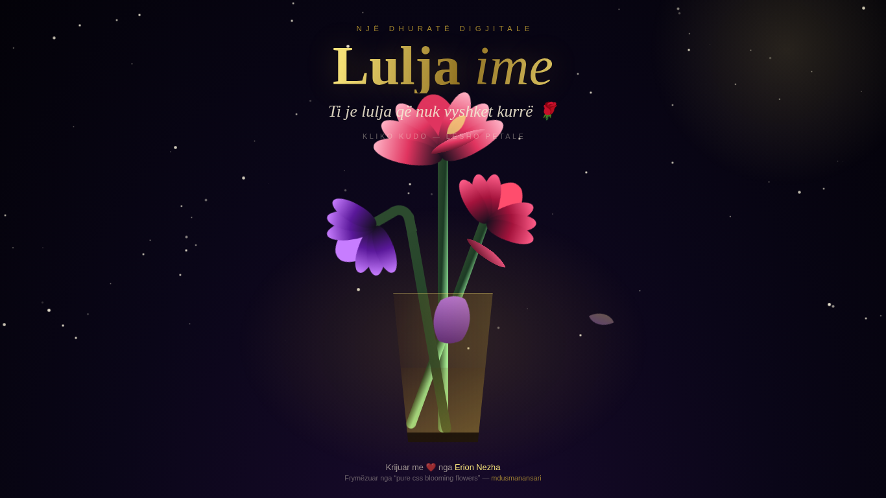

# 🌹 Lulja ime

**Live demo:** https://erionnezha.github.io/Lulja-Ime/

> *Ti je lulja që nuk vyshket kurrë.*

Një kopsht nate premium me lule që çelin — i ndërtuar me CSS të pastër, me temë ari mbi të errët, yje që vezullojnë dhe petale që bien. Kliko kudo në faqe dhe lësho një shi petalesh.

## ✨ Karakteristikat

- 🌸 Tri lule që çelin me animacion CSS — në një vazo qelqi elegante
- 🌟 Qiell nate me 90 yje që vezullojnë
- 🍃 Petale që bien vazhdimisht + shi petalesh me klikim
- 🏆 Titull "Lulja ime" me efekt ari vezullues (shimmer)
- 📱 Plotësisht responsive — duket bukur në telefon dhe desktop

## 🛠️ Teknologjitë

HTML5 · CSS3 (animacione) · JavaScript (vanilla)

## 🙏 Mirënjohje

Mekanika e çeljes së luleve bazohet në pen-in **"pure css blooming flowers with falling leaves"** nga [mdusmanansari](https://codepen.io/mdusmanansari/pen/bGYrmjY) (CodePen) — i ripërpunuar tërësisht në temën premium "Lulja ime" nga Erion Nezha.

## 📄 Licenca

© 2026 Erion Nezha. Të gjitha të drejtat e rezervuara. Shih [LICENSE](LICENSE).

---

# 🌹 Lulja ime (My Flower)

**Live demo:** https://erionnezha.github.io/Lulja-Ime/

> *"You are the flower that never fades."*

A premium night-garden with blooming flowers — built with pure CSS, a gold-on-dark theme, twinkling stars and falling petals. Click anywhere on the page to release a shower of petals.

## ✨ Features

- 🌸 Three CSS-animated blooming flowers in an elegant glass vase
- 🌟 Night sky with 90 twinkling stars
- 🍃 Ambient falling petals + click-to-burst petal showers
- 🏆 "Lulja ime" title with shimmering gold effect
- 📱 Fully responsive — beautiful on mobile and desktop

## 🛠️ Built with

HTML5 · CSS3 (animations) · JavaScript (vanilla)

## 🙏 Credits

The flower-blooming mechanics are based on the pen **"pure css blooming flowers with falling leaves"** by [mdusmanansari](https://codepen.io/mdusmanansari/pen/bGYrmjY) (CodePen) — fully restyled into the premium "Lulja ime" theme by Erion Nezha.

## 📄 License

© 2026 Erion Nezha. All rights reserved. See [LICENSE](LICENSE).

